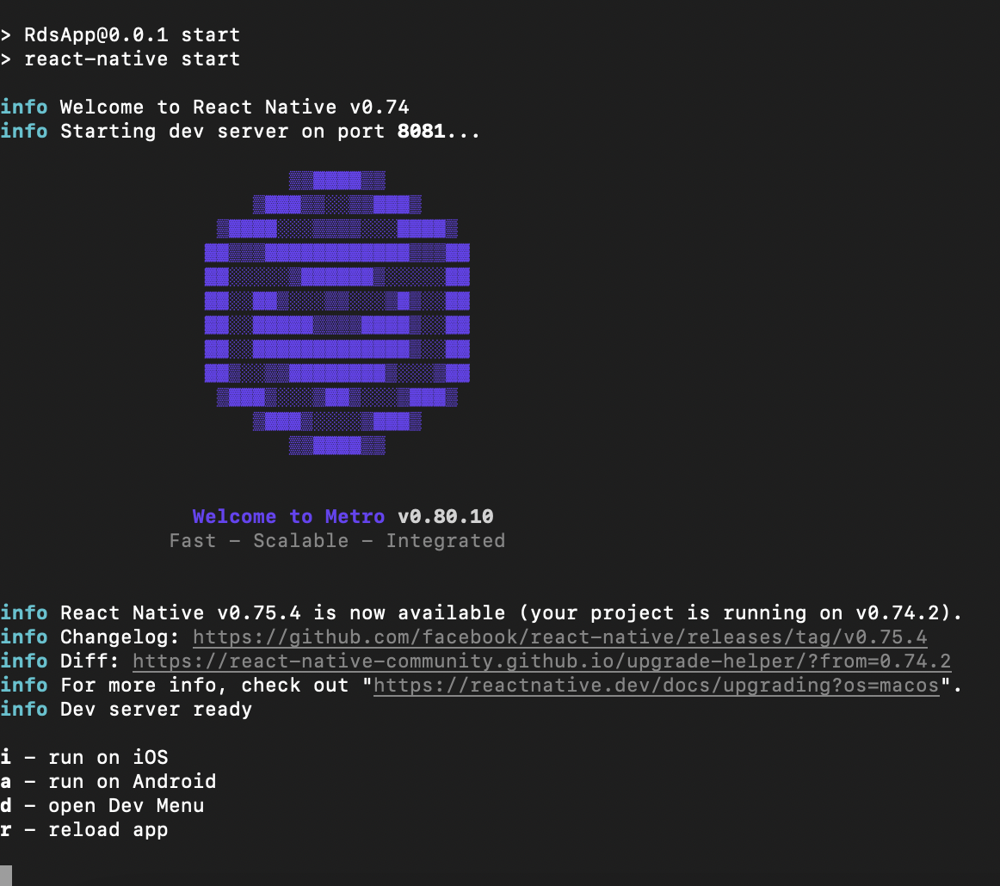

## Real Dev Squad Mobile App

Welcome to the repository of our mobile app, which mirrors all the features of our web applications.

## Tech Stack

- React Native
- TypeScript
- StyleSheet

## About the Project

This project serves as the Real Dev Squad cross-platform mobile app, built using React Native.

## First Phase

- Github Authentication ✅ (we did it via webview, requirement has changed to browser login from github)
- QR code Scanner Authentication ✅
- Three Screens - Home and Profile ✅
- Home screen Features ✅
- Feature with switching from I am idle to doing task ✅
- Feature with switching from out of office from back again ✅
- Profile Screen in which we can change our profile through our phone’s gallery ✅
- API integration in Profile Screen ✅

## Second Phase

- Three Screens - Home , Goals and Profile ✅
- Home screen Features ✅
- Goals site Tab
- Goals site feature will have the TODO app where you can assign the task to the member of the RDS.

Feel free to download our RDS app by clicking on ➡️ [RDS App](https://drive.google.com/file/d/1aEv941izi5bOJzttZj22EKl47jTnsYy_/view?usp=sharing)

**Note** : Please delete the previous RDS app build if you have.

## Prerequisites

To contribute, make sure you have the following:

- React Native setup
- Android Studio
- JDK ( openjdk "17.0.12" 2024-07-16 )
- Node setup ( use version above v18.8*, tested on v20.18*)
- [Volta](https://docs.volta.sh/guide/getting-started) | [Why Volta?](https://docs.volta.sh/guide/#why-volta)
- React Native development environment set up
- Android Studio installed
- Node.js installed
- for Node version management: [Volta](https://docs.volta.sh/guide/getting-started) | [Why Volta?](https://docs.volta.sh/guide/#why-volta)

# **NOTE** : Make sure to set up the proper development environment required to run Hello world app in RN and drop a video link in #react-native channel.

For detailed setup instructions, refer to [React Native environment setup guide](https://reactnative.dev/docs/environment-setup).

### Local App setup

- Set up your local environment for React Native following the environment setup guide.
- Clone the mobile app repository: git clone https://github.com/Real-Dev-Squad/mobile-app.git
- Run the command: `yarn`
- Start contributing!

### Simulator / Physical device running setup



- Start the server as shown above by `yarn start` command.
- Open Android Studio to launch the Android simulator, or alternatively, connect a physical device via USB.
- Press `a` for Android or `i` for iOS to initiate a build that deploys the app to the simulator or connected device.
- If the commands do not work as expected, try building the Android app using Android Studio and the iOS app using Xcode.
- For further assistance, reach out on the `#mobile-app-react-native` channel on Discord.

Happy contributing! 😊

## Contribution Guide

To contribute to our project:

- Browse the issues and comment on the one you'd like to work on.
- Once an issue is assigned to you, follow the local app setup steps.
- Before pushing code, ensure it runs without errors.
- Run yarn run `precommit-check`.
- Commit your changes with a descriptive message.
- Push your code to your branch.
- If you need assistance, reach out on the mobile-app-react-native channel on Discord.

## Git commands for local setup

```
git clone https://github.com/Real-Dev-Squad/mobile-app.git

cd mobile-app

yarn
```

## Git commands to commit your code:

```
git checkout -b 'your-PR-name'

git add <files>

git commit -m "Your commit message"

git push origin your-PR-name

```

## Test-Driven Development (TDD)

All PRs should have 100% test coverage. Before submitting PRs, run yarn test to ensure all tests pass.
